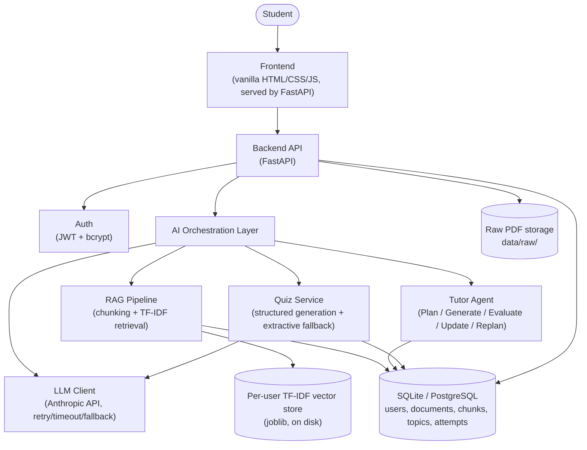
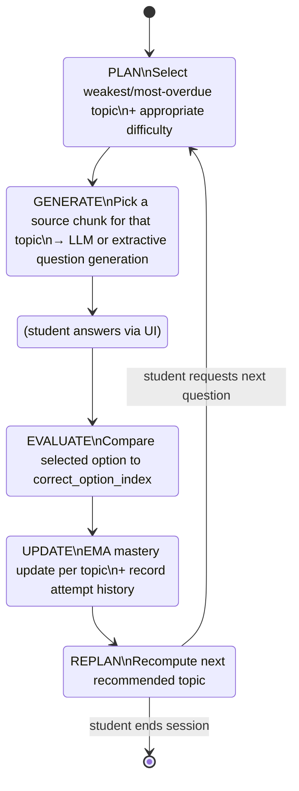
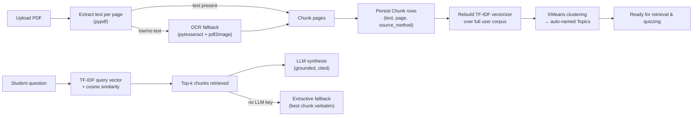
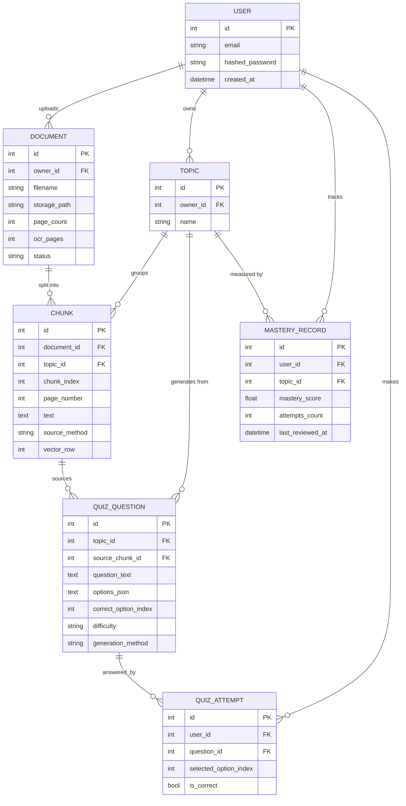
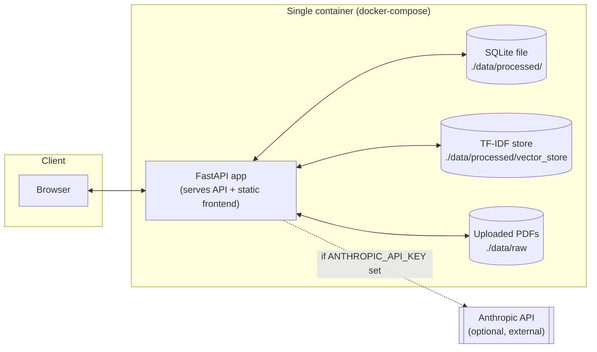

# StudyForge — System Architecture

## 1. High-level architecture

## 2. Why each component exists

| Component | Why it's needed |
|---|---|
| **FastAPI backend** | Async-friendly, automatic OpenAPI docs, first-class Pydantic validation — the standard choice for a Python AI backend. |
| **JWT auth** | Keeps the API stateless (no server-side session store needed at this scale) while keeping each student's materials and progress private. |
| **SQLAlchemy + SQLite (default) / PostgreSQL (production)** | SQLite needs zero setup for local dev and grading; swapping `DATABASE_URL` to a Postgres URL is the only change needed for production, since SQLAlchemy abstracts the dialect. |
| **TF-IDF vector store (per user)** | Fully local, zero-cost, zero-API-key embedding + retrieval. Swappable: `UserVectorStore.rebuild`/`search` are the only two methods that would change to plug in sentence-transformers or a hosted embeddings API. |
| **LLM Client (Anthropic API)** | Generates grounded answers and quiz questions with retries, timeouts, and structured-output validation — never a bare unvalidated prompt-to-text call. |
| **Extractive fallback** | If no `ANTHROPIC_API_KEY` is set (or the API is down), the system still functions: it returns the most relevant excerpt for Q&A and a deterministic fill-in-the-blank question for quizzes, instead of failing. |
| **Tutor Agent** | The agentic core: decides *which* topic and *what difficulty* to serve next based on persisted mastery history — a real decision, not a fixed script. |
| **KMeans topic clustering** | The ML component: automatically groups a newly uploaded document's chunks into topics without requiring the student to manually tag anything. |
| **Frontend (vanilla JS)** | No build step, so the zipped project runs by simply starting the backend — the backend serves the frontend as static files. |

## 3. Agent workflow (Tutor Agent state machine)

## 4. RAG pipeline

**Hallucination-reduction strategy:**
1. The LLM is instructed to answer *only* from the retrieved excerpts.
2. Every excerpt shown to the model is also returned to the student as a citation.
3. If retrieval finds nothing relevant, the system says so rather than letting the model improvise.
4. If the LLM is unavailable, the extractive fallback returns a real excerpt rather than a synthesized (and unverifiable) answer.

## 5. Entity-relationship diagram

## 6. Deployment topology

## 7. Future improvements to this architecture

- Move document processing (`process_document`) to a background task queue (e.g. Celery/RQ) instead of running synchronously on the upload request, so large PDFs don't block the HTTP response.
- Swap the TF-IDF vector store for sentence-transformers or a hosted embeddings API for semantic (not just lexical) retrieval — the `UserVectorStore` interface was designed to make this a contained change.
- Introduce LangGraph if the agent's decision logic grows more branches (e.g. multi-step remediation plans) than the current linear state machine comfortably expresses.
- Add multi-tenant classroom analytics (teacher dashboards aggregating multiple students' mastery).
